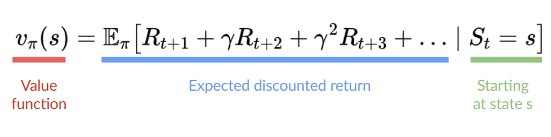
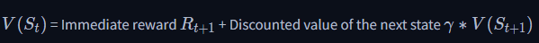
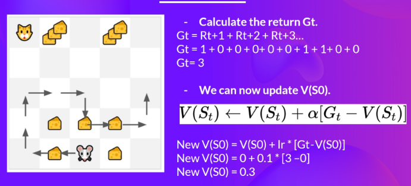
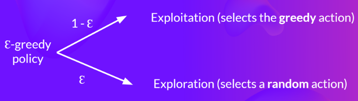
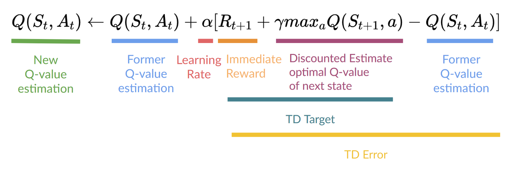

# Theories

## Definition

* **RL** = State (Current observed state of env) + Action (What agent(s) going to do given the state) + Reward (Feedbacks of env from action taken by agent(s)) + NextState (State after action taken) => how agent(s) given a state and action is going to react/behave in a given environment

* **State** = fully observed env, Observation = partially observed env

* **Action space** = all possible actions of an agent toward the env 

    * Discrete space: limited actions (e.g. LRUD)

    * Continous space: infinite actions (e.g. angles turning)

* **Reward**: the sooner the easier to be predicted

    * Gamma = discount rate (0..1), mostly 0.95 <= gamma <= 0.99

    * The larger the gamma, the smaller the discount => prioritize long-term reward

    * The smaller the gamma, the bigger the discount => prioritize short-term reward

    

* **Task** = instance of RL problem

    * Episodic tasks: start and end points (terminal state) <list of States, Actions, Rewards, NewStates>

    * Continuing tasks: no terminal state <learn to choose the best actions while interacting with the environment until the agent decides to stop>

* **Exploration and Exploitation trade off**: Goal = maximize the expected cumulative reward -> requires rules to handle the trade off

    * Exploration: find more info about the env (new path)

    * Exploitation: exploit the known info -> maximize reward (old path)

* **Policy-based**: Policy π = agent's brain -> directly train and teach the agent -> (learn the best path - from optimal policy -> action to take to next state)

    * Deterministic policy: a policy at a given state will always return the same action

    * Stochastic policy: probability distribution over actions = policy(actions | state) 

    * Direct policy + use NN (policy) + NO value function

    * optimal policy (denoted π*) is found by training the policy directly

* **Value-based**: indirectly teach agent to learn which state is more valuable -> (values of each state -> take action lead to it)

    * Learn value func -> map state to expected value (expected discounted return) (use this to define policy)

    * Choose the highest value state to go with

    

    * NO train policy + train NN (value func) + policy defined by hand

    * policy (mostly Epsilon-Greedy Policy) uses values from value-func -> select its actions

    * finding an optimal value function (denoted Q* or V*) leads to having an optimal policy

* **Reinforcement Learning and Deep Reinforcement Learning**

    

    * input is a vector => use **MultiLayerPerceptron (MLPPolicy)**

    * input is a frame => use **CnnPolicy**

* **Values-Based methods** (2 types)

    * Value func = map state -> expected value

    * The value of a state = the expected discounted return

    * State value func -> calculate value of states

    * Action value func -> calculate value of state-action pair

    * Problem: to calculate EACH value of a state or a state-action pair, we need to sum all the rewards an agent can get if it starts at that state.

* **Value calculation: The Bellman Equation**
    
    * The Bellman equation is a recursive equation that works like this: instead of starting for each state from the beginning and calculating the return, we can consider the value of any state.

    * Value of State 1 is equal to the expected cumulative return if we start at that state

    * 

    * value = the sum of immediate reward + the discounted value of the state that follows

* **Monte Carlo** uses an entire episode of experience before learning:
requires a **complete episode of interaction before updating our value function**
At the end of the ep:
    + List of [State, Actions, Rewards, NewStates]
    + Sum total reward Gt (how well it did)
    + Update V(st) accordingly
    + => Start new game with new knowledge

* **Temporal Difference** waits for only one interaction (one step)St+1​ to form a TD target and updateV(St​) using Rt+1​ and γ∗V(St+1​):
=> update the V(St​) at each step
NOT complete sample Gt > estimate Gt = Rt+1​ + γ∗V(St+1​) (Discount value of next state)

* **Q-Learning** = algorithm we use to train our Q-function (action value func)
= off-policy value-based method that uses a TD approach to train its action-value function

    * **Action value func** = value of being at that state + taking that action to be at that state

    * **state-action pair** = the expected cumulative reward our agent gets if it starts at this state (or state-action pair) and then acts accordingly to its policy

    * 

* **Q-func = Q-table** (cheatsheet of the Q-func = state-action pair)
    * **Q-table** includes: State, Action and State-Action values (corresponding)
    * **Optimal Q-func** = Optimal Q-table = Optimal policy
    * **epsilon-greedy strategy** = a policy that handles the exploration/exploitation trade-off
    
    * Start with high value of epsilon (close to 1) -> mostly explore 
    * Training go on -> Q-table better -> lower epsilon -> less exploration and more exploitation 
    * Use a greedy policy to select the next best action -> best state-action pair value
    * Acting policy = select the best next-state action value -> update Q-value (updating policy)
    * On-policy = use the same policy for both acting and updating
    

    